# 데이터 타입

### 원시 자료형(Primitive type)

- 값(value) 자체가 변수에 직접 저장되는 자료형
  - 변수 안에 실제 값이 그대로 저장된다.  
    예: `let num = 10` → 변수 `num`에 숫자 10이 직접 저장됨

- 불변(immutable) 특성
  - 값 자체는 변경되지 않는다.
  - 값을 수정하려면 변수에 **새로운 값을 재할당**해야 한다.
  - 문자열 등 일부만 수정하는 행위는 불가능하다.  
    예:  
    `let str = 'hello'`  
    `str[0] = 'H'` → ❌ (문자열 일부 변경 불가)  
    `str = 'Hello'` → ⭕ (새로운 값 재할당)

- 종류
  - Number
  - String
  - Boolean
  - null
  - undefined


### 참조 자료형(Reference type)

- 데이터가 저장된 메모리의 주소가 변수에 저장되는 자료형
  - 변수에는 실제 값이 아닌 **참조(주소)**가 저장된다.
  - 다른 변수에 대입하면 값을 복사하는 것이 아니라 **주소를 복사**한다.

- 가변(Mutable) 특성
  - 내부 값을 직접 변경할 수 있다.
  - 같은 주소를 참조하면, 한쪽을 수정했을 때 다른 쪽에도 영향을 준다.

- 종류
  - Object
  - Array
  - Function


> ### TIP
> 
> - 참조 자료형은 **주소를 공유**하므로, 복사본을 수정하면 원본도 변경될 수 있다.
> - “값이 불변”이란 값 자체의 일부만 변경할 수 없다는 의미이다.  
>   예:  
>   `let str = 'ssafy'`  
>   `str[0] = 'S'` → ❌ (문자 변경 불가)

---

### 원시 자료형 예시

#### 특징
- 변수를 다른 변수에 할당하면 **값 자체가 복사됨**
- 서로 다른 변수는 **서로 영향을 주지 않음**


#### 예시 1: 문자열(Primitive String)

```javascript
const a = 'bar'
console.log(a) // bar

a.toUpperCase()
console.log(a) // bar (원본 값은 변화 없음)
```

설명:

- `a.toUpperCase()`는 새로운 문자열 'BAR'를 반환하지만   
  원시 자료형 문자열은 **불변(immutable)**이기 때문에   
  원본 a는 그대로 'bar'를 유지한다.


#### 예시 2: 숫자(Number)
```javascript
let a = 10
let b = a   // 값이 복사됨

b = 20

console.log(a) // 10
console.log(b) // 20
```

설명:

- `b = a`를 하는 순간 값 10이 복사되어 `b`에 저장된다.   
  이후 `b`를 20으로 바꿔도 `a`에는 아무 영향이 없다.   
  이는 원시 자료형이 값을 직접 저장하고 복사하기 때문이다.

---

### 참조 자료형 예시

#### 특징
- 객체를 생성하면, 객체가 저장된 **메모리 주소(Reference)**가 변수에 저장됨
- 두 변수가 같은 주소를 참조하면 **한쪽을 변경해도 다른 쪽에 영향이 있음**


### 예시: 객체(Object)

```javascript
const obj1 = { name: 'Alice', age: 30 }
const obj2 = obj1   // 값이 아닌 '주소'가 복사됨

obj2.age = 40

console.log(obj1.age) // 40
console.log(obj2.age) // 40
```

설명

- obj1은 `{name: 'Alice', age: 30} `객체가 저장된 메모리 주소를 보관한다.
- `const obj2 = obj1`는 객체의 “값”이 아니라 **주소(참조)**를 복사한다.
- 따라서 `obj2.age = 40`으로 수정하면   
  → 둘 다 같은 객체를 가리키기 때문에   
  obj1.age도 40으로 바뀐다.

**핵심 요약**

- 원시 자료형: 값이 복사됨 → 서로 영향 없음
- 참조 자료형: 주소가 복사됨 → 서로 영향 있음


---

## 원시 자료형

### 원시 자료형 종류
- Number
- String
- null
- undefined
- Boolean

---

### 원시 자료형 - Number
정수 또는 실수 형태의 숫자를 표현하는 자료형

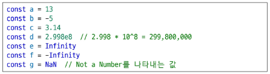

#### 특징
- 사칙연산 및 나머지 연산 가능
- 문자열과 숫자를 더하면, 숫자가 자동으로 문자열로 변환되어 연결됨
- 정수/실수의 구분 없이 모두 단일 Number 타입으로 처리
- Infinity, -Infinity, NaN(Not a Number) 등의 특수한 값 포함

---

### 원시 자료형 - String
텍스트 데이터를 표현하는 자료형

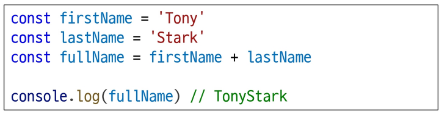

#### 특징
- `+` 연산자를 사용하여 문자열을 이어 붙일 수 있음
- 문자열은 불변(immutable) → 일부 문자를 직접 수정할 수 없음
- 문자열은 기본적으로 유니코드 기반

---

### Template Literals (템플릿 리터럴)
문자열을 보다 편리하게 작성할 수 있는 방식 (ES6+ 부터 지원)
- 파이썬으로 치면, F string과 같은역할을 함.

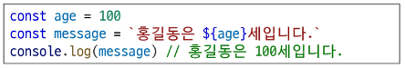

#### 특징
- **백틱( ` )** 을 사용하여 여러 줄 문자열 작성 가능
- `${표현식}` 형태로 변수나 표현식을 문자열 안에 삽입 가능
- 문자열 결합이 쉬워지고 가독성이 좋아짐

---

### null

- 프로그래머가 의도적으로 **'값이 없음'** 을 표현할 때 사용하는 값
- 변수에 “값을 비어있게 설정한다”는 명확한 의미를 가짐

  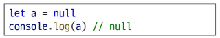
---

### undefined
- 시스템(자바스크립트 엔진)이 **값이 할당되지 않음**을 나타낼 때 사용
- 변수를 선언만 하고 값을 주지 않은 경우 자동으로 undefined가 할당됨
  
  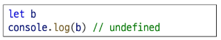

---

### TIP
- `null`의 타입은 `'object'`, `undefined`의 타입은 `'undefined'`이므로 타입 검사 시 주의 필요
- 함수에서 `return`이 없거나 인자를 전달하지 않으면 기본적으로 `undefined`가 됨
- 산술 연산 시 `null`은 0으로 변환되지만, `undefined`는 계산 불가한 NaN을 만들 수 있음

---

### Boolean (불리언)
참과 거짓을 나타내는 논리적 자료형

#### 특징
- 조건문(if), 반복문에서 주로 사용
- Boolean이 아닌 값도 “자동 형변환 규칙”에 따라 true 또는 false로 변환될 수 있음

---

### 자동 형변환 (Truthy / Falsy)

| 데이터 타입 | false로 변환되는 경우 | true로 변환되는 경우 |
|------------|------------------------|------------------------|
| undefined  | 항상 false             | X                      |
| null       | 항상 false             | X                      |
| Number     | 0, -0, NaN             | 나머지 모든 숫자      |
| String     | '' (빈 문자열)         | 나머지 모든 문자열     |

---

### 핵심 요약
- `null`: 의도적 “값 없음”
- `undefined`: 값이 부여되지 않음
- Boolean 변환에서는 일부 값만 falsy, 나머지는 truthy

---

# 연산자

### 연산자 종류

- 할당 연산자
- 증가 & 감소 연산자
- 비교 연산자
- 동등 연산자
- 일치 연산자
- 논리 연산자

---

### 할당 연산자
오른쪽 피연산자의 평가 결과를 왼쪽 피연산자에 저장하는 연산자

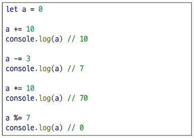

#### 특징
- 값을 대입하거나, 기존 값에 연산을 적용해 다시 넣는 방식
- <u>단축</u> 연산자 지원  
  예: `+=`, `-=`, `*=`, `/=`, `%=`
- `x = x + 1`을 `x += 1`처럼 간단하게 표현 가능

---

### 증가 & 감소 연산자

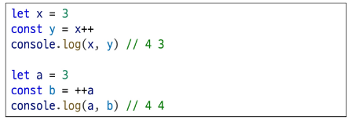

#### 증가 연산자 (`++`)
- 피연산자를 1 증가시키는 연산자
- 앞에 붙느냐(전위) 또는 뒤에 붙느냐(후위)에 따라 평가되는 값이 달라짐

#### 감소 연산자 (`--`)
- 피연산자를 1 감소시키는 연산자
- 전위/후위 위치에 따라 감소 전의 값 또는 감소 후의 값이 반환됨

#### 참고
- 전위/후위 증감연산자는 가독성이 떨어질 수 있어  
  `a += 1`, `a -= 1` 형태의 명시적인 표현을 권장

---

### 비교 연산자
피연산자들(숫자, 문자열, Boolean 등)을 비교하고 결과를 Boolean 값으로 반환하는 연산자

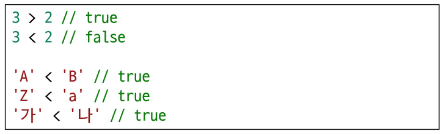

#### 특징
- 크기 비교가 가능함 (>, <, >=, <=)
- 문자열 비교 시 유니코드 값 기준으로 비교됨  
  예: `'A' < 'B'`, `'가' < '나'` 등이 true가 됨

---

### 동등 연산자 (==)
두 피연산자가 **값이 같은지** 비교한 후 Boolean을 반환하는 연산자
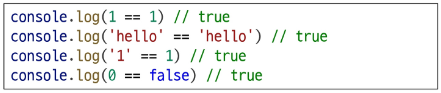

#### 특징
- 비교 전에 **<u>암묵적 타입 변환</u>**이 일어남
- 타입이 달라도 JavaScript가 타입을 맞춘 뒤 비교
- 두 피연산자가 객체라면 같은 객체를 참조하는지 판별

#### TIP
- `0 == false`, `'' == []` 등 직관과 다른 결과가 나올 수 있으므로 주의
- 배열이나 객체는 내용이 같아도 **서로 다른 객체면 false**

---

### 일치 연산자 (===)
두 피연산자의 **값과 타입이 모두 같은 경우**에만 true를 반환하는 연산자
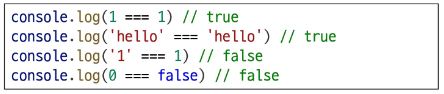

#### 특징
- 타입 변환이 일어나지 않음 (엄격한 비교)
- 같은 객체인지, 같은 타입인지, 같은 값인지 모두 확인
- 예상치 못한 타입 변환을 피하기 위해 **일치 연산자 사용을 권장**

---

### 논리 연산자

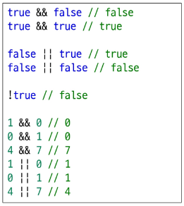

#### and 연산 (&&)
- 두 조건이 모두 true일 때 true 반환
- 하나라도 false면 false 반환

#### or 연산 (||)
- 둘 중 하나라도 true이면 true 반환
- 모두 false일 때 false 반환

#### not 연산 (!)
- 피연산자의 Boolean 값을 반전
- true → false, false → true

---

### 단축 평가 (Short-circuit Evaluation)

#### 특징
- 논리 연산 시, 결과가 이미 결정되면 **남은 피연산자는 평가하지 않음**
- 성능 최적화와 안전한 조건 처리를 위해 자주 사용됨

#### 예시 개념 (코드 없이 설명)
- `A && B` → A가 false이면 B를 보지도 않고 false  
- `A || B` → A가 true이면 B를 보지도 않고 true  
- 값 자체를 반환하기 때문에 조건문 외에도 다양한 활용 가능 (기본값 설정 등)


> - `&&`: 모두 true일 때만 true  
> - `||`: 하나라도 true면 true  
> - `!`: boolean 반전  
> - 단축 평가를 이용하면 불필요한 계산을 피할 수 있음


---

# 조건문

### if 문
조건 표현식의 결과 값을 Boolean 타입으로 변환한 후  
그 값이 참인지 거짓인지에 따라 다른 코드를 실행하는 조건문

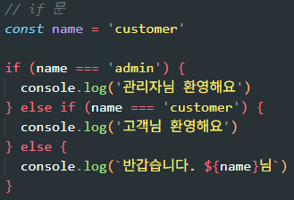

#### 특징
- 조건이 true일 때만 특정 로직을 실행
- 여러 조건을 평가해야 할 경우 `if` - `else if` - `else` 구조를 사용
- 조건 표현식에는 숫자, 문자열, 비교식, 함수 호출 등 어떤 값도 사용 가능

---

### 삼항 연산자 (조건부 연산자)
간단한 조건부 로직을 한 줄로 표현할 때 사용

#### 문법
`condition ? expression1 : expression2`

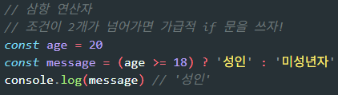

#### 구성 요소
- **condition**: 평가할 조건 (true 또는 false로 변환됨)
- **expression1**: condition이 true일 때 반환되는 값 또는 표현식
- **expression2**: condition이 false일 때 반환되는 값 또는 표현식

#### 특징
- 짧고 간결한 조건 처리에 유용
- 하지만 복잡한 조건을 삼항 연산자로 작성하면 가독성이 떨어질 수 있으므로  
  "간단한 상황에서만" 사용하는 것을 권장

---

# 반복문

### 반복문 종류
- while
- for
- for … in
- for … of

---

### while 반복문
조건문이 true인 동안 문장을 반복해서 수행하는 반복문

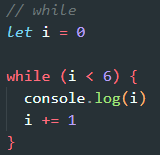

#### 특징
- 조건이 처음부터 false이면 한 번도 실행되지 않을 수 있음
- 반복 횟수가 정해져 있지 않은 상황에서 유용
- 조건이 반드시 언젠가 false가 되도록 조정해야 함 (무한 루프 위험)

---

### for 반복문
특정 조건이 false가 될 때까지 반복 실행하는 구조  
(초기식 → 조건식 → 코드 실행 → 증감식 순서로 동작)

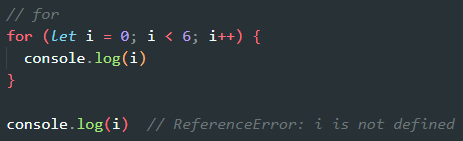

#### 특징
- 반복 횟수가 명확할 때 적합
- 초기식, 조건식, 증감식을 한 줄에서 관리하므로 구조적이고 읽기 쉬움
- 동작 원리  
  1) 초기식 실행  
  2) 조건식 평가  
  3) 코드 블록 실행  
  4) 증감식 실행 후 다시 조건식으로 이동


### 핵심 요약
- **while**: 조건이 참일 때 계속 실행 (반복 횟수 불확실 시 사용)  
- **for**: 조건이 거짓이 될 때까지 반복 (반복 횟수 명확 시 사용)  

---

## for ... in

### for … in 반복문
객체의 열거 가능한(enumerable) 속성(property)의 **키(key)** 를 반복

#### 특징
- 객체를 순회할 때 사용
- key(속성 이름)를 순회함
- 배열에도 사용할 수 있지만, 인덱스 순서를 보장하지 않기 때문에 권장되지 않음
- 객체의 프로토타입에 추가된 속성까지 순회할 수 있어 예기치 않은 결과가 나올 수 있음

---

### for … of 반복문
반복 가능한(iterable) 객체(배열, 문자열 등)의 **값(value)** 을 반복

#### 특징
- 배열, 문자열, Map, Set 등 iterable 자료형 순회에 적합
- 순서가 보장되는 값을 차례대로 제공
- 객체(Object)는 iterable이 아니므로 사용 불가

---

### for … in vs for … of 요약 비교

#### for … in
- 반복 대상: 객체의 key  
- 배열에 사용할 경우: 순서 보장 X, 비권장  
- 프로토타입 속성까지 순회할 수 있어 주의 필요

#### for … of
- 반복 대상: iterable의 value  
- 배열, 문자열 등에 적합  
- 객체는 iterable이 아니므로 사용 불가

---

### 배열 반복과 for … in (1/2)
- 배열의 인덱스도 사실상 “문자열 형태의 속성 이름”이기 때문에 for…in으로 순회 가능
- 그러나 정수가 아닌 이름이나 추가된 속성도 함께 순회될 수 있어 안전하지 않음
- 인덱스 순서가 중요할 때 사용하지 않는 것이 원칙  
➡ **배열의 반복에는 for 문 또는 for … of 사용을 권장**

---

### 배열 반복과 for … in (2/2)
- for … in은 인덱스를 문자열로 반환
- 배열의 프로토타입에 추가된 속성까지 순회할 가능성이 있음
- 예기치 않은 버그를 방지하려면 배열에는 for … of 또는 전통적인 for 문을 사용

---

### 반복문 사용 시 const 사용 여부

#### for 문
- 초기식에서 선언한 변수(i)는 반복할 때마다 값이 변하기 때문에  
  **const 사용 시 에러 발생**
- 즉, for 문에서는 보통 `let` 사용

#### for … in / for … of
- 매 반복마다 “다른 속성 이름” 또는 “다른 값”이 변수에 새로 할당되므로  
  const 사용해도 에러 발생하지 않음
- 단, const 특성상 블록 내부에서 해당 변수를 재할당할 수는 없음

---

### 반복문 종합 요약

| 키워드    | 특징          | 스코프      |
|----------|---------------|-------------|
| while    | 조건 기반 반복 | 블록 스코프 |
| for      | 횟수 기반 반복 | 블록 스코프 |
| for … in | object 순회    | 블록 스코프 |
| for … of | iterable 순회  | 블록 스코프 |

