# 객체

### Object

키로 구분된 데이터 집합을 저장하는 자료형

## 구조 및 속성

### 객체 구조

### 객체 구조(Object Structure)
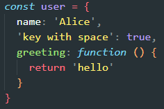
- 객체는 **중괄호 `{}`** 를 사용해 정의한다.
- 중괄호 내부에는 **key: value** 형태의 속성(property)을 여러 개 작성할 수 있다.
- **key는 문자열만 허용**되며, 띄어쓰기나 특수문자가 포함될 수도 있다.
- **value는 모든 자료형**이 올 수 있다.  
  - 예: 문자열, 숫자, 배열, 함수 등  
- 함수가 value로 들어가는 경우, 그 함수는 해당 객체의 **메서드(method)**라고 부른다.

---

### 속성 참조(Property Access)
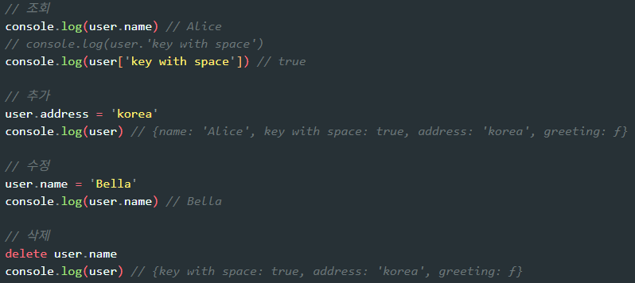
- 객체의 속성은 보통 **점(`.`) 표기법**으로 접근한다.
- key 이름에 **띄어쓰기, 특수문자 등 일반적인 변수명에 사용 불가한 문자가 있는 경우**,  
  → 반드시 **대괄호(`[]`) 표기법**을 사용해야 한다.
- 객체 속성은 생성 후에도 자유롭게 **추가**, **수정**, **삭제**가 가능하다.
  - `obj.key = value` → 추가 또는 수정
  - `delete obj.key` → 삭제

### 추가 설명 (보충 개념)
#### 1. 점 표기법 vs 대괄호 표기법
- 점 표기법은 key가 **정상적인 변수명 규칙을 따를 때**만 사용 가능  
  (예: `name`, `age`, `isAdmin`)
- 대괄호는 key가 문자열로 존재하면 어떤 형태든 접근 가능  
  → `user['key with space']`

#### 2. 객체는 참조 타입
- 객체는 값을 직접 저장하는 것이 아니라 **참조(주소)**를 저장한다.
- 따라서 한 객체를 여러 변수에 할당하면 **동일한 객체를 가리키게 된다.**

---

### 'in' 연산자

- `'in'` 연산자는 **특정 key(속성)가 객체에 존재하는지 여부**를 확인하는 연산자이다.
- 객체뿐 아니라 **배열의 인덱스 존재 여부**도 확인할 수 있다.
- 존재 여부만 확인하며, 값의 실제 내용과는 무관하다.

### ✔ 특징 및 주의사항
- `'in'`은 **프로토타입 체인까지 탐색**한다.  
  → 객체가 직접 가진 속성이 아니어도, 상속된 속성이면 `true`가 될 수 있다.
- 따라서 **의도하지 않은 true**가 발생할 수 있다.

### ✔ TIP
- 객체 내부에 **직접 정의된 속성만 확인**하고 싶다면  
  `'in'` 대신 `hasOwnProperty()` 메서드를 사용하는 것이 더 안전하다.

---

## 메서드

### Method (메서드)

- **메서드(Method)** 는 객체의 속성 중 **값이 함수인 속성**을 의미한다.
- 메서드는 `object.method()` 형태로 호출하며,  
  이를 통해 객체가 특정한 **행동(동작)** 을 할 수 있도록 만든다.
  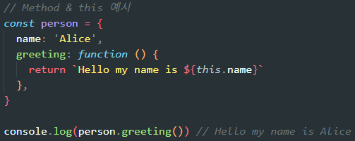

### ✔ 메서드의 특징
- 메서드는 **객체 내부에 정의된 함수**이므로  
  그 객체가 가진 데이터(속성)에 접근할 수 있다.
- 이를 위해 사용하는 키워드가 **`this`** 이다.

### Method 기본 문법
- 메서드는 단순히 “값이 함수인 속성”으로 정의된다.
- 메서드 내부에서 `this`를 사용하면  
  **해당 메서드를 가지고 있는 객체 자체**를 가리킨다.

### ✔ 메서드와 일반 함수의 차이
- 일반 함수: 단독으로 존재하며 특정 객체에 묶여 있지 않음.
- 메서드: **객체에 속한 함수**이기 때문에  
  그 객체의 다른 속성에 쉽게 접근 가능.
- 즉, 메서드는 객체와 **결합된 동작**이라고 볼 수 있다.

---

## this

### 'this' keyword

- **this**는 “현재 실행 중인 함수나 메서드를 호출한 객체”를 가리키는 키워드이다.
- 객체의 메서드 안에서 `this`를 사용하면  
  **그 메서드를 가지고 있는 객체 자신**에 접근할 수 있다.
- 이를 통해 객체 내부의 다른 속성이나 메서드에 접근하고  
  특정한 동작을 수행할 수 있게 된다.

### ✔ this가 중요한 이유
- 메서드는 단순한 함수가 아니라 “객체에 속한 함수”이기 때문에  
  그 객체가 가진 데이터를 활용하여 동작해야 한다.
- `this`를 사용하면 현재 동작을 수행하고 있는 **바로 그 객체**를 가리키므로  
  객체 내부 데이터를 사용하여 처리할 수 있다.

### ✔ 정리
- `this`는 **호출한 주체(객체)**를 가리킨다.
- 메서드 내부에서 객체의 속성에 접근할 때 반드시 필요한 키워드이다.

### JavaScript에서 this는 “함수를 호출하는 방식”에 따라 달라짐

`this`가 무엇을 가리키는지는 **함수가 정의된 위치가 아니라, 어떻게 호출되었는지**에 따라 결정된다.

### ✔ 1. 일반 함수에서의 단순 호출

- 함수를 객체의 메서드로 호출하지 않고, **그냥 호출**하면  
  `this`는 **전역 객체**를 가리킨다.
  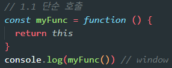
- 브라우저 환경에서는 전역 객체가 `window`이므로  
  단순 호출된 함수 내부의 `this`는 `window`가 된다.
- 즉, 독립적인 함수는 “누가 호출했는가?”라는 정보가 없기 때문에  
  JavaScript는 기본적으로 전역 객체를 `this`로 설정한다.

### ✔ 2. 객체의 메서드로 호출하는 경우
- 함수가 객체의 속성(메서드)으로 존재하고,  
  **object.method() 형태로 호출될 때**,  
  `this`는 **그 메서드를 호출한 객체**를 가리킨다.
  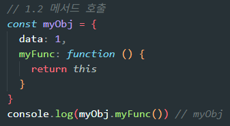
- 즉, “점(.) 왼쪽에 있는 객체”가 `this`가 된다.
- 이 경우 함수는 단순한 함수가 아니라 객체의 동작으로 인식되며  
  해당 객체 내부의 속성이나 메서드에 접근할 수 있다.

### ✔ 3. 중첩된 함수(콜백 함수)에서의 this 문제
- 메서드 내부에서 또 다른 함수를 정의하거나  
  콜백(예: `forEach`의 콜백)으로 함수를 전달하면,  
  그 내부 함수는 **일반 함수처럼 호출**된다.
- 따라서 내부 함수의 `this`는 다시 **전역 객체**를 가리키게 된다.
  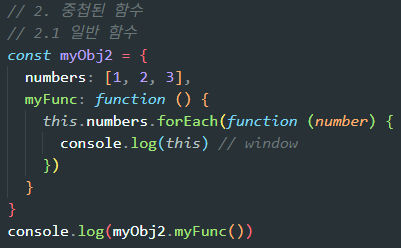
- 즉, 바깥 함수는 객체의 메서드라 `this`가 객체를 가리키지만  
  내부 콜백 함수는 “누가 호출했는지” 정보가 없으므로  
  `this`가 일관되지 않게 동작하는 문제가 생긴다.

### 해결책: 화살표 함수 사용

- **화살표 함수는 자신만의 this를 가지지 않는다**는 중요한 특징이 있다.
- 따라서 화살표 함수 내부에서의 `this`는  
  화살표 함수가 선언된 **외부 함수(메서드)**의 `this`를 그대로 가져온다.
  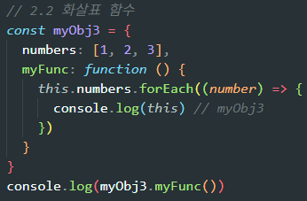
- 이로 인해 콜백 함수 내부에서도  
  바깥 객체를 가리키는 올바른 `this`를 유지할 수 있다.

---

### JavaScript ‘this’ 정리

- JavaScript에서 함수는 **호출될 때**, 호출한 주체의 정보를 암묵적으로 전달받는다.
- 따라서 `this`는 함수가 어떻게 “호출되었는지”에 따라 동적으로 결정된다.
- 이는 Python의 `self`나 Java의 `this`처럼  
  **정의 시점에서 고정되는 개념이 아니다.**

#### 장점
- 하나의 함수(메서드)를 여러 객체가 공유하더라도  
  호출한 객체에 따라 각각 다르게 동작할 수 있다.
- 즉, 메서드 재사용성과 유연성이 높아진다.

#### 단점
- 호출 방식에 따라 this가 달라지므로  
  초보자에게 혼란을 주기 쉽고 실수로 이어질 수 있다.
- 특히 콜백 함수 내부에서 this가 바뀌는 현상이 대표적인 문제이다.

> ### TIP
> - JavaScript에서 this가 무엇을 의미하는지 알고 싶을 때는  
>   **“누가 점(.)을 찍어서 호출했는가?”**를 확인하면 된다.  
>   점 앞에 있는 객체가 바로 this가 된다.

---

## 추가 객체 문법

### 1. 단축 속성 (Shorthand Property)
- 객체를 생성할 때 **key와 value가 동일한 이름의 변수일 경우**,  
  `key: value` 형태를 축약하여 **이름만 적는 단축 문법**을 사용할 수 있다.
- 예를 들어, `name: name`은 `name`으로 단축할 수 있다.
  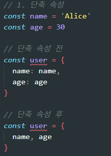

---

### 2. 단축 메서드 (Shorthand Method)
- 객체 내부에서 메서드를 정의할 때  
  `myFunc: function () {}`처럼 길게 쓰지 않고  
  **function 키워드를 생략한 축약 문법**을 사용할 수 있다.
  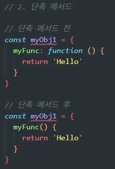
- 즉, 메서드 이름 뒤에 바로 괄호를 붙여 메서드를 정의한다.

---

### 3. 계산된 속성 (Computed Property Name)
- 객체의 key를 **대괄호(`[]`) 안에 표현식 형태로 작성**하여  
  **동적으로 key를 생성할 수 있는 기능**이다.
  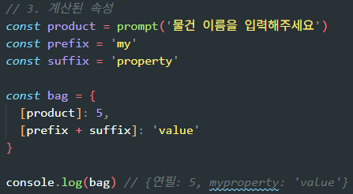
- 문자열 결합, 변수 값 등을 이용하여  
  미리 정해지지 않은 key 이름을 만들 수 있다.
- 예를 들어, `[prefix + suffix]`와 같이 계산된 값을 key로 사용한다.

> ### ✔ TIP
> - 계산된 속성 표현식을 너무 복잡하게 만들면  
>   **어떤 key가 생성되는지 파악하기 어려워져 가독성이 떨어진다.**
> - 의도하지 않게 동일한 key가 만들어져 기존 값을 덮어쓰는 위험이 있으므로  
>   **적절한 선에서 사용하는 것이 좋다.**

---

### 4. 구조 분해 할당 (Destructuring Assignment)

#### (1) 기본 개념
- 객체의 여러 속성을 각각 변수에 하나씩 할당할 때  
  반복적으로 `obj.key`를 쓰지 않고 **간단한 문법으로 분해하여 변수로 할당**하는 방식.
  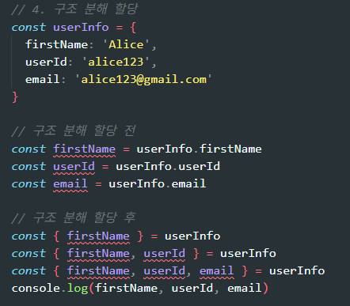
- 필요한 속성만 골라서 변수로 추출할 수 있으며, 객체 구조를 직관적으로 표현할 수 있다.

#### (2) 함수 매개변수에서 사용
- 함수의 매개변수 위치에서도 구조 분해 할당을 사용할 수 있다.
  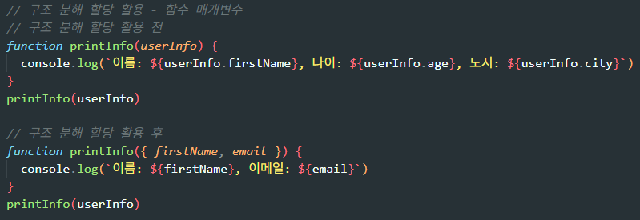
- 함수가 받는 객체를 매개변수 단계에서 바로 분해함으로써  
  함수 내부 코드를 더 간결하게 만들 수 있다.
- 예: `function printInfo({ name, age, city })`처럼  
  전달받은 객체의 필요한 속성만 선택하여 바로 변수로 활용 가능.

---

### 5. 객체와 전개 구문 (Spread Syntax)

- 전개 구문(`...obj`)을 사용하면 **객체를 얕게 복사**하거나  
  새로운 객체를 만들 때 기존 객체의 속성을 펼쳐 넣을 수 있다.
  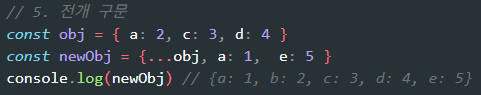
- “얕은 복사”란 최상위 속성만 복제하고  
  중첩된 객체는 여전히 원본 객체와 참조를 공유한다는 의미이다.
- 새로운 객체를 만들 때 기존 객체의 속성을 확장하거나,  
  새로운 속성을 덧붙이는 작업에 매우 유용하다.

---

### 6. 유용한 객체 메서드

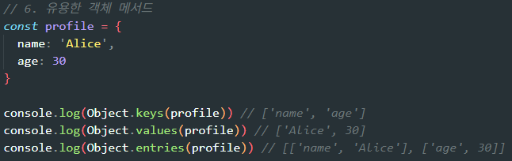

#### Object.keys()
- 객체의 **key 값들을 배열**로 반환한다.
- 객체 속성 이름만 필요할 때 사용한다.

#### Object.values()
- 객체의 **value 값들을 배열**로 반환한다.
- 속성 값만 모아서 처리할 때 유용하다.

#### Object.entries()
- 객체의 key와 value를 **쌍으로 묶어 배열로 반환**한다.  
  예: `[ ['name', 'Alice'], ['age', 30] ]`
- 객체를 반복(iteration) 처리하거나,  
  key-value를 한 번에 다루고 싶을 때 매우 편리하다.
