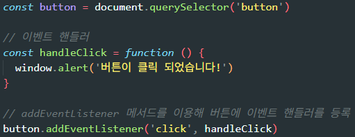
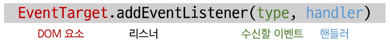
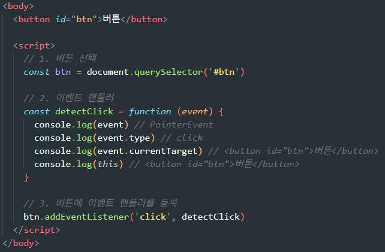
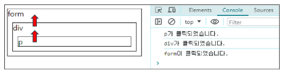
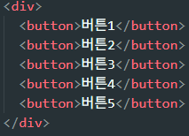
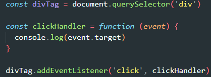

# 이벤트

### 일상 속의 이벤트
- 이벤트란 **어떤 행동이나 상황 변화가 발생하는 순간**을 의미함  
- 키보드를 눌러 텍스트를 입력하는 행위  
- 전화벨이 울려 알림을 받는 상황  
- 손을 흔들어 인사하는 동작  
- 전화기의 버튼을 눌러 통화를 시작하는 것  
- 리모컨으로 채널을 변경하는 것  
→ 일상에서도 끊임없이 사건(이벤트)이 발생하며, 그에 반응하는 동작들이 존재함

### 웹에서의 이벤트
- 화면을 스크롤하는 사용자 행동  
- 버튼을 클릭했을 때 팝업 창이 나타나는 반응  
- 마우스 커서 위치에 따라 드래그 앤 드롭이 동작하는 상호작용  
- 키보드 입력 값에 따라 새로운 요소를 만드는 변화  
→ **웹의 거의 모든 상호작용은 이벤트와 함께 이루어짐**

---

## event

### event란 무엇인가
- 웹 페이지에서 **'무언가가 일어났다는 신호 또는 사건'**  
- 사용자가 특정 요소와 상호작용할 때 발생함  
- 예: 마우스를 영화 포스터에 올리면 이벤트가 발생하고, 시스템은 이를 감지(리스너)하여 미리보기(핸들러) 같은 반응을 보여줌  
- 클릭, 입력, 변경 등 마우스·키보드의 모든 움직임이 이벤트가 될 수 있음  
→ 이벤트는 **사용자 행동 → 시스템 감지 → 반응 실행**의 흐름을 중심으로 동작함

### DOM 요소와 이벤트
- DOM 요소는 HTML 문서의 각 태그가 객체로 변환된 것  
- 모든 DOM 요소는 **다양한 형태의 이벤트를 발생**시킬 수 있음  
- 예:  
  - button 클릭 → click 이벤트  
  - input 값 변경 → input/change 이벤트  
- 즉, DOM이 존재하는 모든 부분에서 이벤트 발생 가능  
→ 브라우저는 DOM을 기반으로 이벤트를 감지하고, JavaScript는 그 이벤트에 따라 동작을 제어함

---

## event object

### event object
- DOM에서 이벤트가 발생하면 브라우저는 해당 이벤트에 대한 정보를 담은 **event object(이벤트 객체)** 를 자동 생성함
- 이벤트 객체는 **언제, 어디서, 어떤 방식으로** 이벤트가 발생했는지에 관한 상세 정보를 담고 있음
- 주요 이벤트 종류
  - mouse 이벤트
  - input 이벤트
  - keyboard 이벤트
  - 그 외 다양한 이벤트들

> ### TIP
> - 이벤트 객체는 이벤트 발생 순간의 상황을 설명하는 데이터 묶음  
>   (예: 어떤 요소에서 발생했는지, 마우스 좌표는 어디인지, 눌린 키는 무엇인지 등)
> - 이를 통해 **이벤트와 관련된 구체적인 정보**를 코드에서 사용할 수 있음

### 이벤트와 이벤트 핸들러
- DOM 요소에서 event가 발생하면  
  → 해당 event는 연결된 **event handler(이벤트 처리기)** 가 실행되며 처리됨
- event handler는 이벤트에 반응하여 실행되는 함수 역할  
  (슬라이드의 예: 주문(Event) → 바리스타(Event Handler)의 처리 과정)

## event handler

### event handler
- **특정 이벤트가 발생했을 때 실행되는 함수(콜백 함수)**  
- 사용자의 행동(클릭, 입력, 마우스 이동 등)에 반응하여 실행됨  
- 예: 영화 포스터에 마우스를 올리면(이벤트) → 미리보기 영상/설명을 보여주는 동작(핸들러)

→ 이벤트 핸들러는 “이벤트 발생 시 어떤 동작을 수행할지” 정의하는 핵심 요소

### `.addEventListener()`
- **특정 DOM 요소에 특정 이벤트가 발생했을 때 실행할 이벤트 핸들러를 등록하는 메서드**
- 역할  
  - 이벤트를 감지할 '**리스너**'를 붙임  
  - 이벤트가 발생하면 → 연결된 핸들러(콜백 함수)가 실행됨  
- 버튼 클릭, 입력 변경, 마우스 이동 등 다양한 이벤트를 연결 가능함

→ addEventListener는 “DOM 요소 + 이벤트 + 핸들러”를 연결해주는 기능을 담당함
- 순서  
  1) 요소 가져오기   
  2) 함수 작성하기 (event handler)    
  3) 연결(button, handle click)

### addEventListener() 예시

- `handleClick` 함수는 **이벤트 핸들러** 역할을 함  
- `button.addEventListener('click', handleClick)`는  
  버튼 요소에 **click 이벤트가 발생했을 때 handleClick 함수를 실행하도록 연결**하는 과정임

### 동작 개념 정리
1. **DOM 요소 선택**  
   - 브라우저 화면에서 버튼 요소를 가져옴  
2. **이벤트 핸들러 정의**  
   - 클릭되었을 때 어떤 동작을 수행할지(경고창 띄우기) 함수로 작성  
3. **addEventListener로 연결**  
   - 클릭 이벤트가 발생하면 → 해당 핸들러가 실행되도록 설정  

### 요약
- 이벤트 핸들러: "클릭 시 실행할 함수"  
- addEventListener: "DOM 요소 + 이벤트 + 핸들러"를 연결하는 도구  

---

### 이벤트 등록(addEventListener) 개념 정리

- **DOM 요소**  
  - HTML 문서의 각 태그가 브라우저에서 객체 형태로 변환된 것  
  - 예: `<button>`, `
` 등이 모두 DOM 객체가 됨

- **수신할 이벤트(type)**  
  - “무언가 일어났다는 신호”  
  - 예: `click`, `input`, `mouseover`, `keydown` 등

- **핸들러(handler)**  
  - 이벤트가 실제로 발생했을 때 실행되는 **콜백 함수**  
  - 이벤트 발생 → 브라우저가 이 함수를 호출하여 동작 수행

---

### addEventListener 구조

- **EventTarget**: 이벤트를 등록할 DOM 요소  
- **type**: 어떤 이벤트를 감지할 것인지 지정  
- **handler**: 이벤트 발생 시 실행할 함수  

**메서드 구문**
  - `addEventListener(type, handler)`
  - DOM 요소에 “어떤 이벤트(type)가 발생하면, 이 함수(handler)를 실행해라”라고 등록하는 형태

---

### type (수신할 이벤트 유형)
- 감지하고 싶은 이벤트 이름을 문자열로 작성  
  - 예: `'click'`, `'mouseover'`, `'input'`, `'keydown'` 등  
- 브라우저가 해당 이벤트를 감지하면 등록된 핸들러가 호출됨

### handler (이벤트 핸들러)
- 이벤트 발생 시 실행되는 **콜백 함수**
- 자동으로 **event 객체를 첫 번째 매개변수로 전달**받음  
  - 예: `function(event) { ... }`
- 반환값은 없음 (목적은 오직 “이벤트 처리”)

### 정리
- addEventListener는  
  **요소 + 이벤트 종류 + 실행할 함수**  
  이 세 가지를 연결해주는 기본 메서드임

---

### 이벤트 객체 전달

- 이벤트가 발생하면 브라우저는 **이벤트 객체(event)** 를 자동으로 이벤트 핸들러의 첫 번째 인자로 전달함  
- 핸들러 함수는 이 객체를 이용해  
  - 이벤트가 발생한 요소  
  - 이벤트 타입  
  - 추가 정보(pointer, 키 값 등)  
  에 접근할 수 있음  
- 이를 통해 각각의 상황에 맞는 동작을 수행 가능함

### 이벤트 핸들러에서의 this
- 일반 함수를 이벤트 핸들러로 사용할 경우,  
  **this는 해당 이벤트 리스너가 연결된 DOM 요소**를 가리킴  
- 이는 `event.currentTarget`과 동일한 값  
- 즉, 핸들러 내부에서는  
  - `this` → 이벤트가 걸린 요소  
  - `event.currentTarget` → 동일하게 이벤트 연결 요소  
  를 의미함

### 정리
- 이벤트 객체는 핸들러에게 "이벤트 관련 정보"를 전달하는 역할  
- 이벤트 핸들러 내부에서 `this`는 이벤트가 연결된 DOM 요소를 의미  
- 따라서 `this`와 `event.currentTarget`은 동일한 상황에서 동일한 대상을 가리킴

---

# 버블링

### 버블링(Bubbling)
- 어떤 요소에서 이벤트가 발생하면  
  그 요소의 핸들러가 먼저 실행되고, 이후 **부모 요소 → 그 부모 요소** 순으로 차례로 이벤트가 전파되는 현상  
- 이벤트는 가장 안쪽의 요소에서 시작해 바깥쪽으로 올라가면서,  
  각 요소에 등록된 같은 종류의 이벤트 핸들러를 모두 실행함  
- 최상단(document)까지 도달할 때까지 이 과정이 반복됨  

### 예시 설명

- `
` 요소를 클릭하면  
  1) `
`의 이벤트 핸들러  
  2) 부모 `
`의 핸들러  
  3) 그 부모 `<form>`의 핸들러  
  순으로 차례대로 실행됨  
- 즉, **하위 → 상위 방향**으로 이벤트가 올라가며 실행되는 구조  

> ### TIP
> - 이벤트가 “가장 깊은 요소에서 시작해 부모 요소를 향해 거슬러 올라가는” 방식이  
>   **물이 아래에서 위로 거품처럼 올라오는 모습과 닮았다 해서 ‘버블링’**이라고 부름

---

### 이벤트가 정확히 어디서 발생했는지 접근하는 방법

#### 1. event.**currentTarget**
- **현재 요소**를 가리킴  
- 이벤트 핸들러가 **연결된 요소**만을 참조하는 속성  
- 즉, 이벤트가 어디에서 시작되었는지와 상관없이  
  “지금 이 핸들러가 실행되고 있는 요소”를 의미  
- 일반적으로 `this`와 동일하게 동작함  

#### 2. event.**target**
- **이벤트가 실제로 시작된 가장 안쪽 요소**(target)를 참조  
- 사용자가 실제로 클릭·입력한 바로 그 요소  
- 이벤트가 버블링되더라도 **target 값은 변하지 않음**  
  → 이벤트가 어디서 시작되었는지 정확하게 알 수 있음  

#### 정리
- `currentTarget` → “핸들러가 연결된 요소”  
- `target` → “이벤트가 실제 발생한 요소”  
- 버블링 환경에서 두 값이 달라질 수 있어, 이벤트를 구분할 때 중요한 차이임

---

## 캡쳐링과 버블링

### 캡처링(capturing)

- 캡처링은 **이벤트가 최상위 요소에서부터 타깃 요소까지 내려가는 단계**를 의미함  
- 버블링이 “안쪽 → 바깥쪽”으로 올라가는 흐름이라면,  
  **캡처링은 그 반대 방향인 “바깥쪽 → 안쪽”으로 내려오는 흐름**임  

### 캡처링의 동작 방식
- 예를 들어, table 안의 가장 안쪽 요소 `<td>`를 클릭했다고 가정하면  
  1) 이벤트는 먼저 **최상단 요소(window, document, html…)에서 시작**해  
  2) 해당 `<td>`까지 **아래로 내려오면서 전달됨 (캡처링 단계)**  
  3) 실제 이벤트가 발생한 지점(event.target)에서 핸들러 실행  
  4) 그 후 다시 **버블링 단계에서 위로 올라가며** 상위 요소의 핸들러들이 실행됨  

### 핵심 정리
- 캡처링 단계: **최상위 → 타깃 요소로 내려가는 전파**  
- 타깃 단계: **실제 이벤트가 발생한 지점에서 실행**  
- 버블링 단계: **타깃 → 상위 요소로 올라가는 전파**  

> ### TIP
> - 실제 개발에서는 **버블링 핸들링이 훨씬 자주 사용**됨  
> - 캡처링을 직접 활용하는 경우는 거의 없으므로,  
>   기본적으로 이벤트는 “버블링을 기준으로 동작한다”는 흐름을 이해하는 것이 중요함

---

## 버블링의 필요성

### 버블링이 필요한 이유 (1/2)

- 여러 개의 버튼이 각각 다른 동작을 수행한다고 가정하면,  
  버튼마다 개별적으로 이벤트 핸들러를 등록하는 것은 **비효율적**임  
- 이럴 때, 모든 버튼의 **공통 조상 요소(예: div)** 에 이벤트 핸들러를 **단 한 번만 등록**하면 됨  
- 이렇게 하면 버튼을 클릭할 때마다  
  이벤트는 버블링을 통해 div까지 올라오므로,  
  공통 div에서 모든 버튼 클릭을 처리할 수 있음  

### 버블링이 필요한 이유 (2/2)

- 공통 조상에 단 하나의 핸들러만 등록해두면  
  여러 자식 요소의 이벤트를 **한 곳에서 효율적으로 관리**할 수 있음  
- 왜 가능할까?  
  → 버블링 덕분에 이벤트가 자식에서 부모로 올라오고,  
  → 핸들러 내부에서 `event.target`을 사용하면  
    “어떤 버튼이 실제로 클릭되었는지” 정확히 알 수 있기 때문  

### 정리
- 버블링은 많은 요소를 각각 처리하지 않고  
  **공통 부모 요소 한 곳의 핸들러로 모두 처리할 수 있게 해 주는 중요한 메커니즘**  
- 이를 활용하는 기법을 **이벤트 위임(Event Delegation)** 이라고 함  

## event handler 활용

<실습 파트는 실습파일에서!>

## 이벤트 기본 동작 취소하기

- HTML 요소는 각자 **기본적으로 실행되는 고유한 동작(기본 이벤트)** 을 가지고 있음  
- 하지만 개발자가 원하는 흐름을 만들기 위해서는  
  이 기본 동작이 **오히려 방해가 되는 경우**가 있음  
- 이런 상황에서 기본 동작을 막아주는 기능이 필요함  

---

### 기본 동작을 취소해야 하는 예시
- **form 제출 이벤트 취소**  
  - form은 제출되는 순간 자동으로 페이지가 새로고침됨  
  - 데이터 검증 등 추가 작업을 위해 기본 새로고침 동작을 막아야 함  

- **a 태그의 페이지 이동 취소**  
  - 클릭 시 자동으로 링크로 이동하지만  
  - 이동을 막고 다른 기능(팝업 표시, 모달 열기 등)을 수행하고 싶을 때 사용  

### `.preventDefault()`

- `.preventDefault()`는  
  **해당 이벤트에 대한 기본 동작을 실행하지 않도록 막는 기능**  
- 예를 들어, 회원가입 폼을 작성 중 실수로 뒤로가기 버튼을 눌렀을 때  
  실제 뒤로 이동하기 전에 “정말 이동하시겠습니까?”와 같은 동작을 만들 때도 사용됨  
- 즉, 기본 동작이 실행되어 **데이터가 초기화되거나 페이지가 이동하는 것을 방지하는 용도**

### 이벤트 동작 취소 실습 목록
1. copy 이벤트의 기본 동작 취소  
2. form 제출 시 자동 새로고침 동작 취소  

---

# 참고

## addEventListener와 화살표 함수 관계

### addEventListener에서의 화살표 함수 주의사항

### 화살표 함수의 this 특징
- 화살표 함수는 **자신만의 this를 가지지 않음**  
- 대신, **자신이 선언된 상위 스코프의 this 값을 그대로 물려받음**  
- 즉, addEventListener의 핸들러로 화살표 함수를 사용하면  
  **this가 이벤트가 걸린 요소가 아니라 window(전역 객체)를 가리키게 됨**

### 왜 문제가 될까?
- 일반 함수 핸들러에서는  
  `this` → 이벤트가 연결된 DOM 요소를 의미  
- 하지만 화살표 함수를 쓰면  
  `this` → DOM 요소가 아닌 상위 스코프(대부분 window)를 가리키므로  
  **이벤트가 발생한 요소에 접근하는 기능을 잃게 됨**

### 해결책
1. **일반 함수(function) 사용하기**  
   - 일반 함수는 this가 이벤트가 연결된 요소를 바르게 가리킴  

2. **화살표 함수를 꼭 써야 한다면?**  
   - this 대신 **event.currentTarget** 사용하기  
   - currentTarget은 항상 핸들러가 연결된 요소를 정확하게 가리킴  

### 정리
- 화살표 함수는 this를 바인딩하지 않기 때문에  
  이벤트 핸들러로 사용할 때 주의가 필요함  
- DOM 요소에 접근하려면  
  **일반 함수 or event.currentTarget 활용**이 필수  
